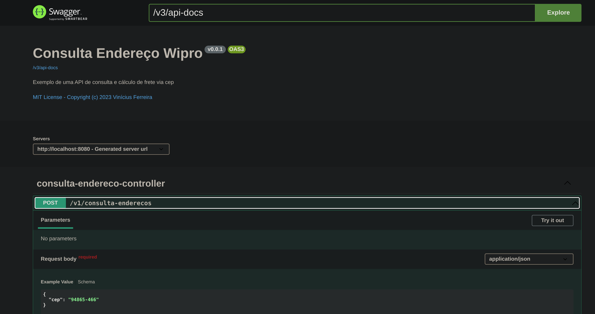
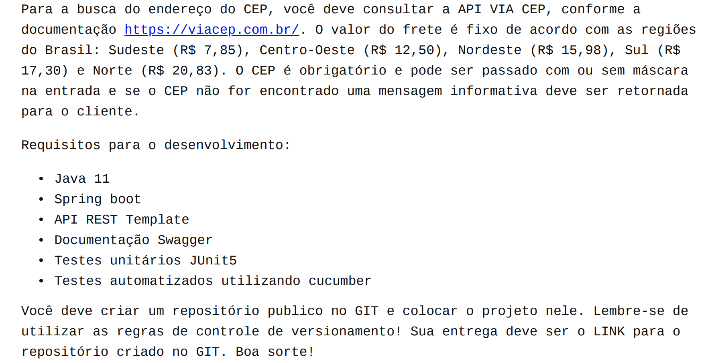

# Spring API consulta-endereco Wipro
_Destinado à criação de uma API REST visando o processo seletivo de backend Java na Wipro (Bradesco)_

## Passo a passo

**Acessando o Swagger:** 

- ``http://localhost:8080/swagger-ui/index.html``

**Configurações do Swagger:**

- ``http://localhost:8080/v3/api-docs``

## Rodando a aplicação no Docker

**Buildando a imagem:**  
Vá para a pasta raiz do projeto onde o Dockerfile se encontra e digite no terminal:
- ``docker build -t consulta_endereco .`` e em seguida:
- ``docker run -d --name consulta_endereco -p 8080:8080 consulta_endereco``

Pra ver se o container está de pé 
- ``docker ps``

## Proposta do desafio

